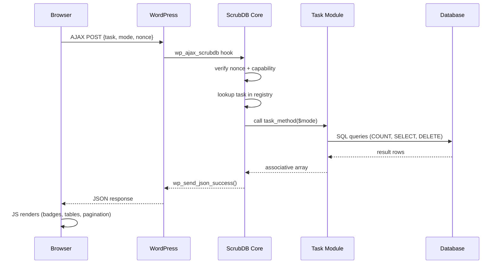
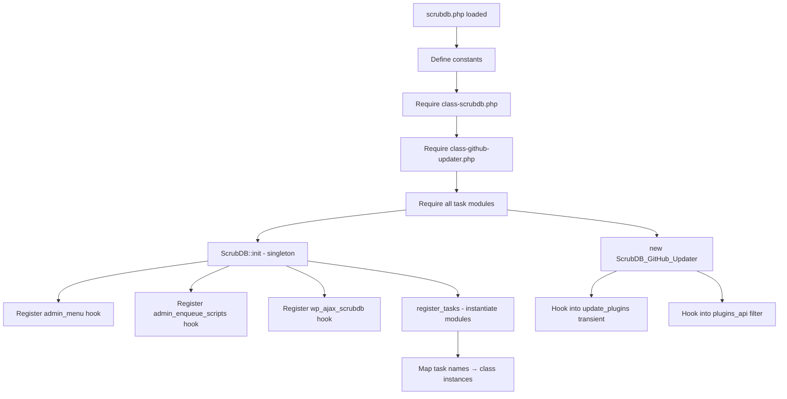
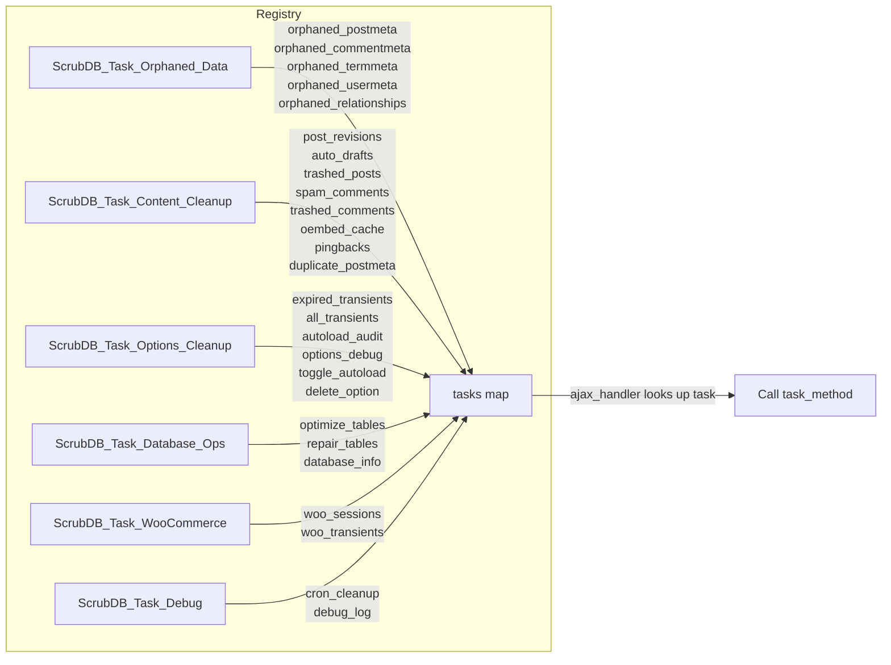
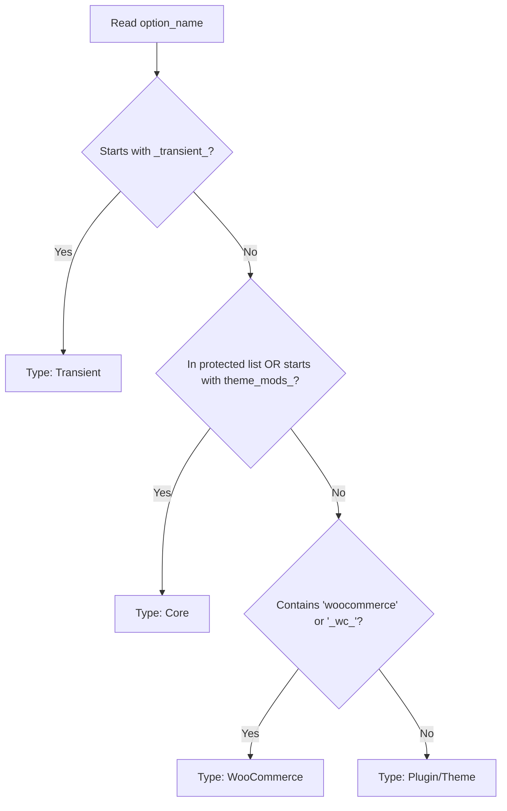
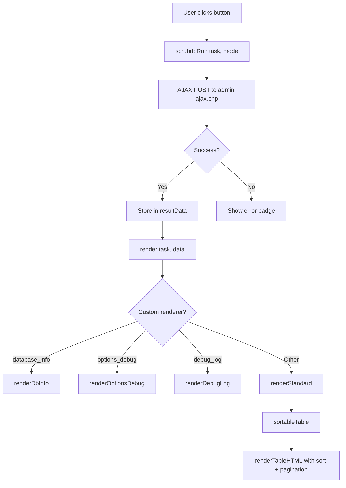
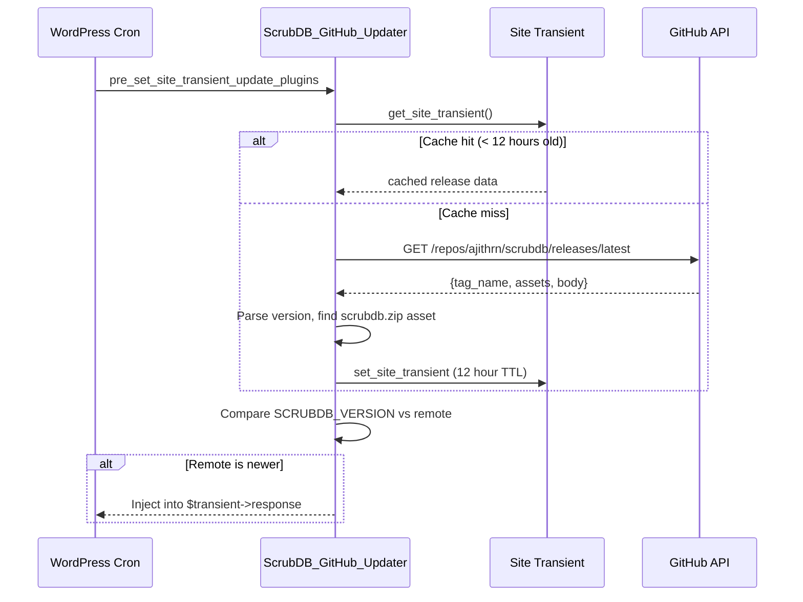

# Architecture

## Overview

ScrubDB follows a dispatcher + task module pattern. The core class handles admin registration, AJAX routing, and asset loading. Individual task modules handle the actual database queries and diagnostic logic.

```
scrubdb/
├── scrubdb.php                      # Bootstrap: constants, requires, init
├── includes/
│   ├── class-scrubdb.php            # Core: menu, AJAX dispatcher, assets
│   ├── class-github-updater.php     # Auto-update from GitHub releases
│   └── tasks/
│       ├── class-orphaned-data.php  # Orphaned metadata detection/cleanup
│       ├── class-content-cleanup.php # Revisions, drafts, spam, duplicates
│       ├── class-options-cleanup.php # Transients, autoload audit, option mgmt
│       ├── class-database-ops.php   # Optimize, repair, DB info
│       ├── class-woocommerce.php    # WC sessions and transients
│       └── class-debug.php          # Cron cleanup, debug.log
├── admin/
│   ├── admin-page.php               # HTML template (tab-based UI)
│   ├── css/admin.css                # All styles
│   └── js/admin.js                  # AJAX, rendering, sort, pagination
├── .github/
│   └── workflows/release.yml        # Auto-release on version bump
└── docs/
```

## Request Lifecycle



## Plugin Initialization



## Task Registry & Dispatch



## How Each Task Category Identifies Problems

### Orphaned Data Detection

Each orphaned data task uses a `LEFT JOIN` pattern to find metadata rows whose parent entity no longer exists:

```sql
-- Pattern: find rows in meta table where parent is gone
SELECT COUNT(*)
FROM {meta_table} m
LEFT JOIN {parent_table} p ON m.{fk_column} = p.ID
WHERE p.ID IS NULL
```

| Task | Meta Table | Parent Table | FK Column | What It Means |
|------|-----------|--------------|-----------|---------------|
| `orphaned_postmeta` | `wp_postmeta` | `wp_posts` | `post_id` | Post was deleted but meta rows remain |
| `orphaned_commentmeta` | `wp_commentmeta` | `wp_comments` | `comment_id` | Comment deleted, meta left behind |
| `orphaned_termmeta` | `wp_termmeta` | `wp_terms` | `term_id` | Taxonomy term removed, meta orphaned |
| `orphaned_usermeta` | `wp_usermeta` | `wp_users` | `user_id` | User deleted, meta persists |
| `orphaned_relationships` | `wp_term_relationships` | `wp_posts` | `object_id` | Post gone, taxonomy links remain |

Cleanup uses `ScrubDB::batch_delete()` which runs `DELETE ... LIMIT 1000` in a loop to avoid timeouts on large datasets.

### Content Cleanup Detection

| Task | Detection Query | Why It Accumulates |
|------|----------------|-------------------|
| `post_revisions` | `post_type = 'revision'` | WP saves a revision on every post update |
| `auto_drafts` | `post_status = 'auto-draft'` | Created every time you open "Add New Post" |
| `trashed_posts` | `post_status = 'trash'` | Trash isn't auto-emptied by default |
| `spam_comments` | `comment_approved = 'spam'` | Akismet flags but doesn't delete |
| `trashed_comments` | `comment_approved = 'trash'` | Same as trashed posts |
| `oembed_cache` | `meta_key LIKE '_oembed_%'` | Cached embed HTML in postmeta |
| `pingbacks` | `comment_type IN ('pingback','trackback')` | Automated cross-site notifications |
| `duplicate_postmeta` | `GROUP BY post_id, meta_key, meta_value` then find extras | Plugins sometimes double-write meta |

### Options Table Diagnostics

The options table (`wp_options`) is critical because **autoloaded options load on every single page request**. ScrubDB identifies problems by:

1. **Expired transients** — `option_name LIKE '_transient_timeout_%' AND option_value < UNIX_TIMESTAMP()` — these are cache entries past their TTL
2. **All transients** — `option_name LIKE '_transient_%' OR '_site_transient_%'` — total transient footprint
3. **Autoload audit** — `WHERE autoload = 'yes' ORDER BY LENGTH(option_value) DESC` — finds the biggest autoloaded options
4. **Options X-Ray** — Full table analysis with classification:



### WooCommerce Detection

- **Expired sessions** — `wp_woocommerce_sessions WHERE session_expiry < UNIX_TIMESTAMP()` — customer cart sessions past expiry
- **WC transients** — `option_name LIKE '_transient_wc_%' OR '_transient_timeout_wc_%'` — WooCommerce-specific cache

### Database Operations

- **Optimize** — Queries `information_schema.TABLES WHERE DATA_FREE > 0` to find tables with reclaimable overhead, then runs `OPTIMIZE TABLE`
- **Repair** — Runs `REPAIR TABLE` on all `wp_*` tables (useful after crashes or corruption)
- **Database info** — Reads `information_schema.TABLES` for engine, row count, data+index size, and overhead per table

### Debug & Cron

- **Orphaned cron** — Iterates `_get_cron_array()`, checks each hook with `has_action($hook)`. If no callback is registered (plugin deactivated), it's orphaned
- **Debug log** — Reads `WP_CONTENT_DIR . '/debug.log'`, shows last 50 lines, reports file size

## Frontend Architecture



### Table Engine

All data tables use a shared sortable + paginated engine:

1. **State stored per table** — `tableState[stateId]` holds items array, columns, current page, sort key, sort direction
2. **Sort** — Click any column header to sort. Numeric values sort numerically, strings sort alphabetically. Clicking same column toggles asc/desc
3. **Pagination** — 20 items per page, client-side (all data loaded in one AJAX call). Prev/Next + page number buttons
4. **Re-render** — Sort or page change re-renders only that table's container via `$('#' + stateId).html(...)`

## Auto-Update System



## Security Model

- All AJAX requests require `scrubdb_nonce` verification via `check_ajax_referer()`
- All operations require `manage_options` capability (administrator only)
- Protected options list prevents modification of critical WP core options
- `$_POST` input sanitized with `sanitize_text_field()` and `absint()`
- SQL queries use `$wpdb->prepare()` for all dynamic values
- Batch deletes use `LIMIT` to prevent long-running queries from timing out

## Asset Loading & Cache Busting

- CSS and JS are enqueued only on the `tools_page_scrubdb` hook (plugin's own page)
- Both use `SCRUBDB_VERSION` as the version parameter: `wp_enqueue_style('scrubdb-admin', ..., [], SCRUBDB_VERSION)`
- This means every release automatically busts browser caches
- No build step required — plain CSS and vanilla jQuery JS
