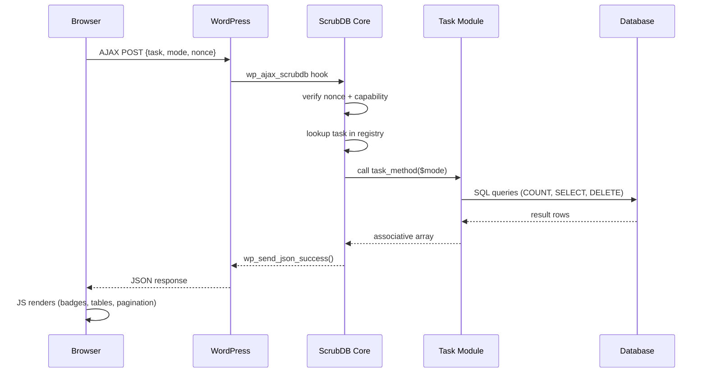
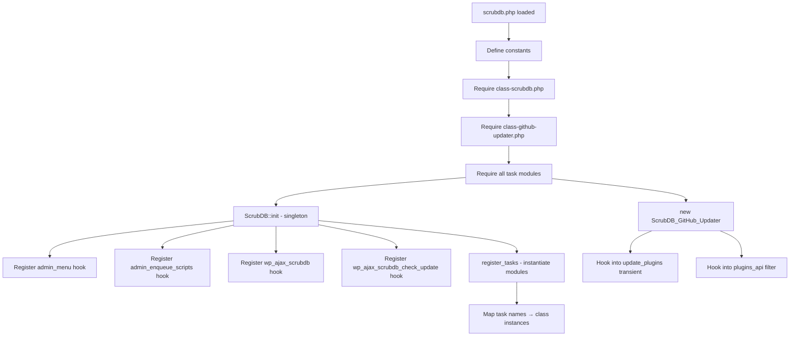
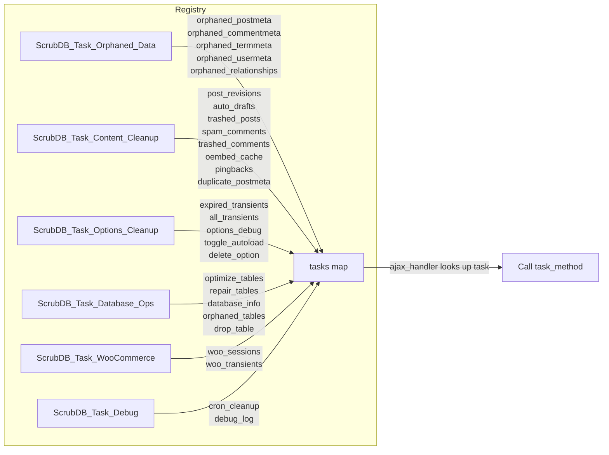
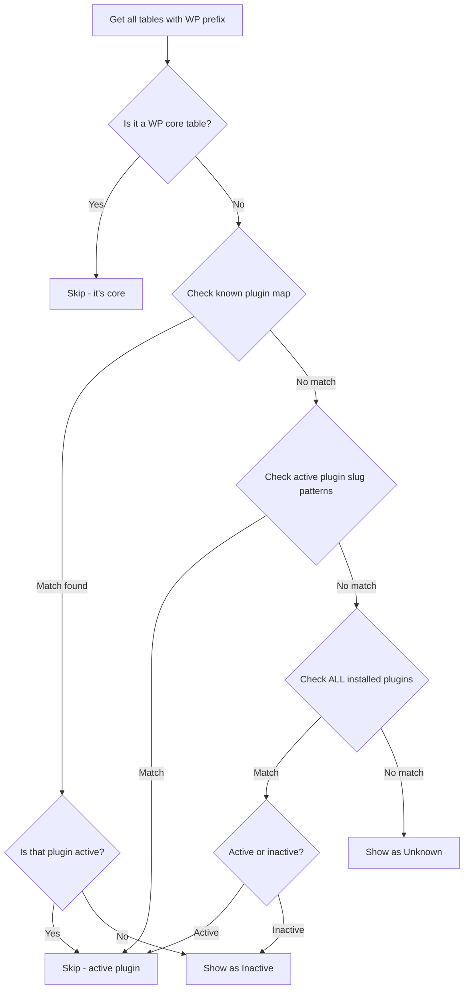
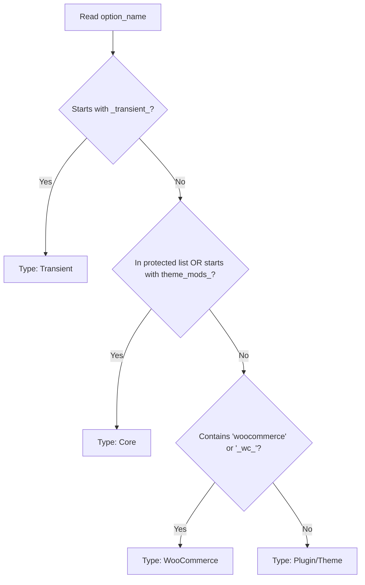
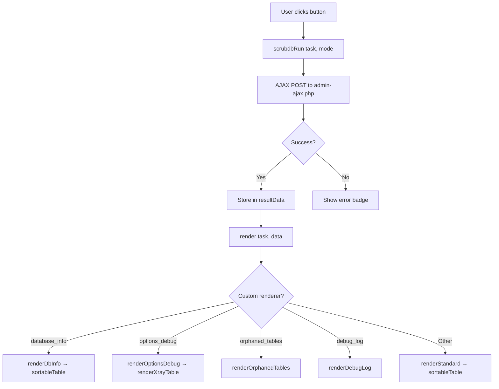
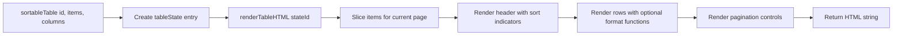
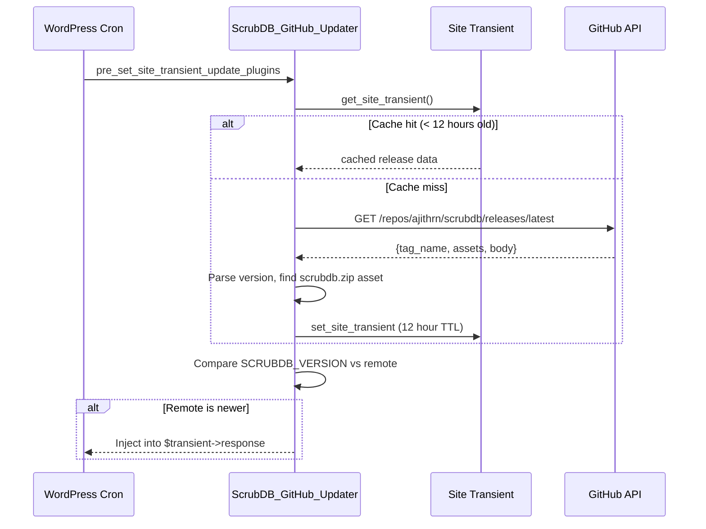

# Architecture

## Overview

ScrubDB follows a dispatcher + task module pattern. The core class handles admin registration, AJAX routing, and asset loading. Individual task modules handle the actual database queries and diagnostic logic.

```
scrubdb/
├── scrubdb.php                      # Bootstrap: constants, requires, init
├── includes/
│   ├── class-scrubdb.php            # Core: menu, AJAX dispatcher, assets
│   ├── class-github-updater.php     # Auto-update from GitHub releases
│   └── tasks/
│       ├── class-orphaned-data.php  # Orphaned metadata detection/cleanup
│       ├── class-content-cleanup.php # Revisions, drafts, spam, duplicates
│       ├── class-options-cleanup.php # Transients, options X-Ray, option mgmt
│       ├── class-database-ops.php   # Optimize, repair, DB info, orphaned tables
│       ├── class-woocommerce.php    # WC sessions and transients
│       └── class-debug.php          # Cron cleanup, debug.log
├── admin/
│   ├── admin-page.php               # HTML template (tab-based UI)
│   ├── css/admin.css                # All styles
│   └── js/admin.js                  # AJAX, rendering, sort, pagination
├── .github/
│   └── workflows/release.yml        # Auto-release on version bump
└── docs/
```

## Request Lifecycle



## Plugin Initialization



## Task Registry & Dispatch



**Total: 26 registered tasks across 6 modules.**

## How Each Task Category Identifies Problems

### Orphaned Metadata Detection

Each orphaned data task uses a `LEFT JOIN` pattern to find metadata rows whose parent entity no longer exists:

```sql
SELECT COUNT(*)
FROM {meta_table} m
LEFT JOIN {parent_table} p ON m.{fk_column} = p.ID
WHERE p.ID IS NULL
```

| Task | Meta Table | Parent Table | FK Column | What It Means |
|------|-----------|--------------|-----------|---------------|
| `orphaned_postmeta` | `wp_postmeta` | `wp_posts` | `post_id` | Post was deleted but meta rows remain |
| `orphaned_commentmeta` | `wp_commentmeta` | `wp_comments` | `comment_id` | Comment deleted, meta left behind |
| `orphaned_termmeta` | `wp_termmeta` | `wp_terms` | `term_id` | Taxonomy term removed, meta orphaned |
| `orphaned_usermeta` | `wp_usermeta` | `wp_users` | `user_id` | User deleted, meta persists |
| `orphaned_relationships` | `wp_term_relationships` | `wp_posts` | `object_id` | Post gone, taxonomy links remain |

Cleanup uses `ScrubDB::batch_delete()` which runs `DELETE ... LIMIT 1000` in a loop to avoid timeouts on large datasets.

### Orphaned Tables Detection

Identifies database tables that don't belong to WordPress core or any currently active/installed plugin.



**3-layer detection system:**

1. **Known plugin map** (checked first, most reliable) — Hardcoded mapping of 50+ popular plugins that use non-obvious table prefixes:
   - `wc_*` / `woocommerce_*` → WooCommerce
   - `actionscheduler_*` → Action Scheduler (shared library)
   - `yoast_*` → Yoast SEO
   - `e_*` → Elementor
   - `pmxe_*` / `pmxi_*` → WP All Export / Import
   - `gf_*` / `rg_*` → Gravity Forms
   - `wf*` → Wordfence
   - `icl_*` → WPML
   - `nf3_*` → Ninja Forms
   - `frm_*` → Formidable Forms
   - And 40+ more...

2. **Active plugin slug patterns** — For each active plugin, generates matching patterns:
   - Full slug normalized (`woocommerce`, `easy_digital_downloads`)
   - Abbreviation from first letters (`edd`, `wfr`)
   - First word if ≥4 chars (`gravity`, `easy`)

3. **All installed plugins** (active + inactive) with flexible matching:
   - Exact start match (`facetwp_index` starts with `facetwp`)
   - Strip `wp_`/`wordpress_` prefix and retry
   - Compact slug (remove underscores) for concatenated names (`wpzerospam`)
   - Slug as a segment anywhere in the table name

### Content Bloat Detection

| Task | Detection Query | Why It Accumulates |
|------|----------------|-------------------|
| `post_revisions` | `post_type = 'revision'` | WP saves a revision on every post update |
| `auto_drafts` | `post_status = 'auto-draft'` | Created every time you open "Add New Post" |
| `trashed_posts` | `post_status = 'trash'` | Trash isn't auto-emptied by default |
| `spam_comments` | `comment_approved = 'spam'` | Akismet flags but doesn't delete |
| `trashed_comments` | `comment_approved = 'trash'` | Same as trashed posts |
| `oembed_cache` | `meta_key LIKE '_oembed_%'` | Cached embed HTML in postmeta |
| `pingbacks` | `comment_type IN ('pingback','trackback')` | Automated cross-site notifications |
| `duplicate_postmeta` | `GROUP BY post_id, meta_key, meta_value` then find extras | Plugins sometimes double-write meta |

### Options Table Diagnostics

The options table (`wp_options`) is critical because **autoloaded options load on every single page request**.

**WP 6.6+ compatibility:** The autoload column changed from `'yes'`/`'no'` to `'on'`/`'off'`/`'auto-on'`/`'auto-off'`. ScrubDB uses `IN ('yes','on','auto-on','auto')` to handle both formats via the `autoload_values()` helper.

**Options X-Ray** provides full table analysis with type classification:



**Inline actions:** Toggle autoload on/off, delete individual options (with protected core options list preventing dangerous modifications).

### Database Operations

- **Optimize** — Queries `information_schema.TABLES WHERE DATA_FREE > 0` to find tables with reclaimable overhead, then runs `OPTIMIZE TABLE`
- **Repair** — Runs `REPAIR TABLE` on all `wp_*` tables (useful after crashes or corruption)
- **Database info** — Reads `information_schema.TABLES` for engine, row count, data+index size, overhead, plus owner identification per table
- **Orphaned tables** — Detects and allows dropping tables from removed plugins (type-to-confirm safety)
- **Drop table** — Requires exact table name confirmation, blocks core tables

### WooCommerce Detection

- **Expired sessions** — `wp_woocommerce_sessions WHERE session_expiry < UNIX_TIMESTAMP()`
- **WC transients** — `option_name LIKE '_transient_wc_%' OR '_transient_timeout_wc_%'`

### Debug & Cron

- **Orphaned cron** — Iterates `_get_cron_array()`, checks each hook with `has_action($hook)`. If no callback is registered (plugin deactivated), it's orphaned
- **Debug log** — Reads `WP_CONTENT_DIR . '/debug.log'`, shows last 50 lines, reports file size

## Frontend Architecture



### Sortable + Paginated Table Engine

All data tables use a shared engine (`sortableTable()` → `renderTableHTML()`):



**Features:**
- **State per table** — `tableState[stateId]` holds items, columns, page, sortKey, sortDir
- **Sort** — Click any column header. Numeric values sort numerically, strings alphabetically. Same column toggles asc/desc
- **Pagination** — 20 items per page, client-side. Prev/Next + page number buttons
- **Custom formatters** — Columns can define a `format(value, row)` function for custom rendering (e.g., status badges)
- **Custom renderer** — X-Ray table uses `renderXrayTable()` (flagged via `s.custom = true`) for inline action buttons
- **Re-render** — Sort or page change re-renders only that table's container

### Tab Navigation

- Tabs persist via URL hash (`#overview`, `#options`, etc.)
- WooCommerce tab conditionally rendered (PHP-side check for active WC)
- About tab includes manual "Check for Updates" button (AJAX to GitHub API)

## Auto-Update System



**Manual check:** The About tab has a "Check for Updates" button that clears the transient cache and fetches fresh data from GitHub via a separate AJAX endpoint (`wp_ajax_scrubdb_check_update`).

## Security Model

- All AJAX requests require `scrubdb_nonce` verification via `check_ajax_referer()`
- All operations require `manage_options` capability (administrator only)
- Protected options list prevents modification of critical WP core options (`siteurl`, `active_plugins`, `db_version`, etc.)
- Core tables list prevents dropping essential WordPress tables
- Drop table requires typing the exact table name to confirm
- `$_POST` input sanitized with `sanitize_text_field()` and `absint()`
- SQL queries use `$wpdb->prepare()` for all dynamic values
- Table names escaped with `esc_sql()` before use in queries
- Batch deletes use `LIMIT` to prevent long-running queries from timing out

## Asset Loading & Cache Busting

- CSS and JS are enqueued only on the `tools_page_scrubdb` hook (plugin's own page)
- Both use `SCRUBDB_VERSION` as the version parameter — every release busts browser caches
- No build step required — plain CSS and vanilla jQuery JS
- File sizes: ~700 lines CSS, ~650 lines JS — single file each (no splitting needed)
